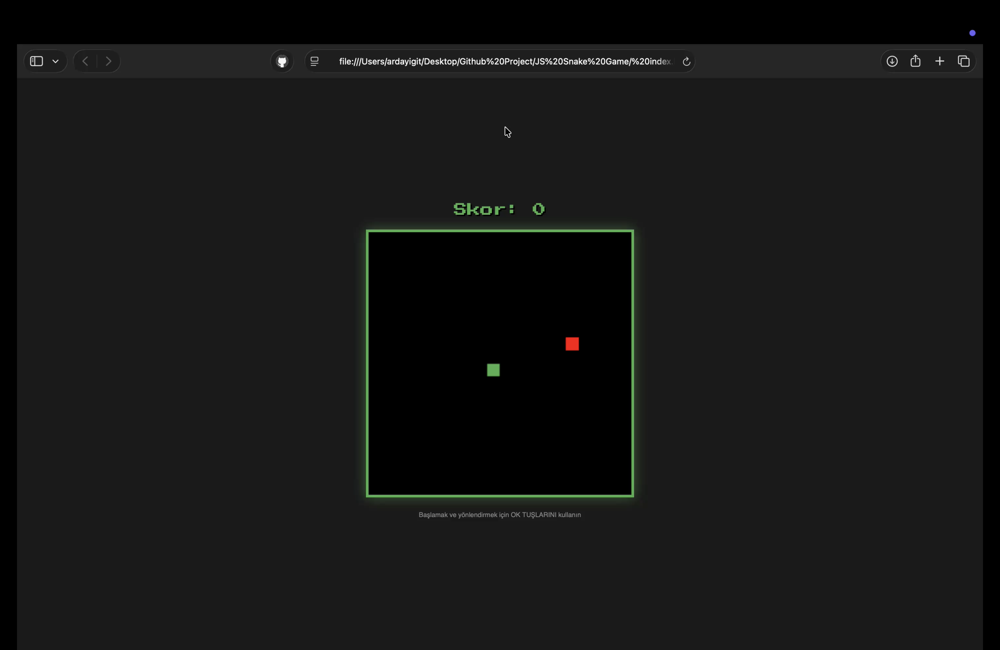
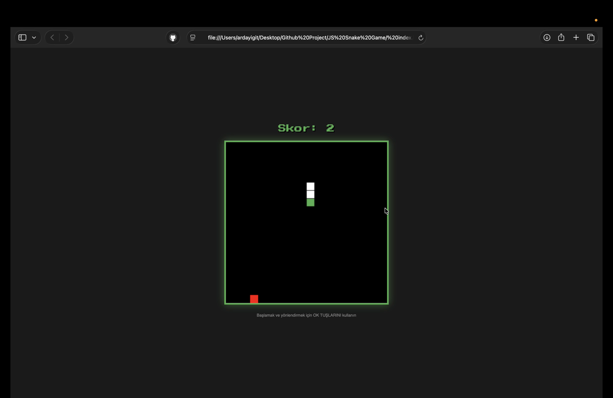
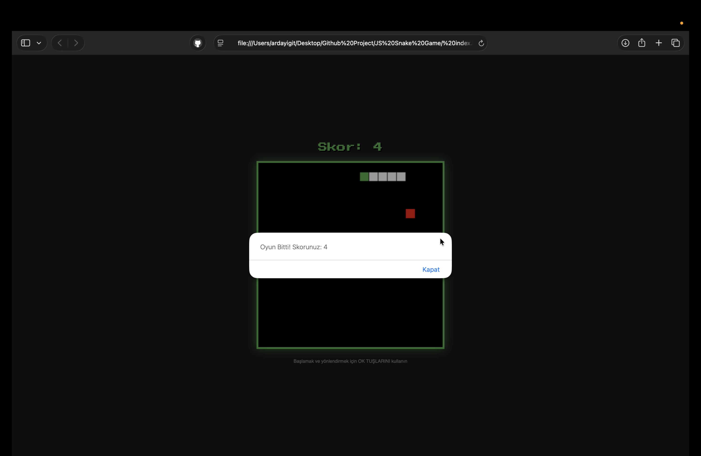

# 🐍 Classic Snake Game


**Classic Snake Game**, HTML5 Canvas API ve Vanilla JavaScript kullanılarak geliştirilmiş, retro tarzda bir tarayıcı oyunudur.

Bu proje, temel oyun geliştirme prensiplerini (Game Loop, Rendering, Collision Detection) anlamak ve uygulamak amacıyla geliştirilmiştir.

## 🕹️ Canlı Demo

[>> Oyunu Oynamak İçin Tıkla <<](https://ygtarda.github.io/snake-game)
## 📸 Oynanış (Gameplay)






## ✨ Özellikler

* **🎮 Klasik Mekanikler:** Yılan yem yedikçe uzar ve hız sabit kalır.
* **💥 Çarpışma Algılama (Collision Detection):** Duvarlara veya kendi kuyruğuna çarpınca oyun biter.
* **📊 Skor Takibi:** Anlık skor takibi ekranda görüntülenir.
* **🎨 Retro Tasarım:** Nostaljik piksel görünümü ve neon renk paleti.
* **⌨️ Klavye Kontrolü:** Ok tuşları (Arrow Keys) ile pürüzsüz yönlendirme.

## 🛠️ Kullanılan Teknolojiler

* **HTML5 Canvas:** Oyunun grafiklerini (kare kare) çizmek ve temizlemek için.
* **Vanilla JavaScript:** Oyun mantığı, döngüler ve durum yönetimi.
* **CSS3:** Oyun alanını ortalamak ve retro stil vermek için.

## 🧠 Nasıl Çalışır? (Game Logic)

Bu proje, arkada çalışan birkaç temel algoritma üzerine kuruludur:

1.  **Oyun Döngüsü (Game Loop):** `setInterval` kullanılarak oyun alanı belirli aralıklarla (örn: 100ms) temizlenir ve yeniden çizilir.
2.  **Yılanın Hareketi:** Yılan, bir koordinat dizisi (`Array of Objects`) olarak tutulur. Her karede, yılanın başı gidilen yöne eklenir (`unshift`) ve kuyruğu silinir (`pop`). Böylece hareket illüzyonu yaratılır.
3.  **Yem Yeme:** Yılanın başının koordinatları, yemin koordinatlarıyla eşleşirse kuyruk silinmez (büyüme gerçekleşir) ve skor artar.

## 💻 Kurulum ve Çalıştırma

Projeyi yerel bilgisayarınızda çalıştırmak için:

1.  **Repoyu Klonlayın**
    ```bash
    git clone [https://github.com/ygtarda/snake-game.git](https://github.com/ygtarda/snake-game.git)
    ```

2.  **Klasöre Girin**
    ```bash
    cd snake-game
    ```

3.  **Başlatın**
    `index.html` dosyasını tarayıcınızda açmanız yeterlidir.

## 👤 Yazar

**Arda Yiğit**
* GitHub: [@ygtarda](https://github.com/ygtarda)
* LinkedIn: [Arda Yiğit](https://www.linkedin.com/in/arda-yigit)

---
*If you enjoyed this game, give it a ⭐!*